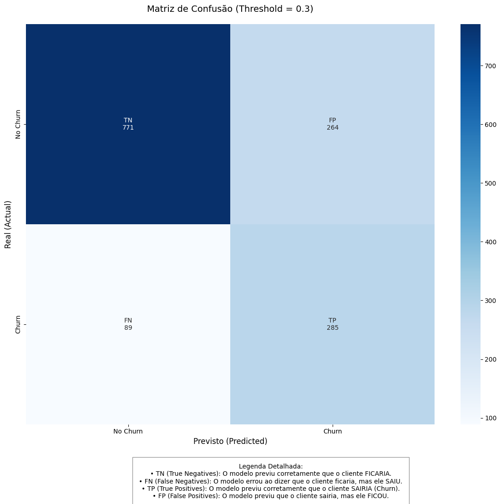

Tech Challenge 01 — Previsão de Churn End-to-End
================================================

Este projeto apresenta uma solução de Machine Learning para prever o cancelamento de clientes (churn). A arquitetura foi desenhada seguindo os princípios de **Engenharia de Software e MLOps**, utilizando ***PyTorch*** para a rede neural e ***FastAPI*** para o serviço de predição.

🎯 Contexto de Negócio (Método STAR)
------------------------------------
- **Situation**: Operadoras de telecomunicações enfrentam alta rotatividade de clientes. Identificar o churn antes que ele ocorra é vital para a saúde financeira.

- **Task**: Criar um modelo preditivo robusto (MLP), um pipeline de dados reprodutível e uma API monitorada.

- **Action**: 
    - Realizada EDA profunda nos notebooks para identificar correlações críticas e direcionar a engenharia de atributos.
    - Refatoração e Modularização: Migração do código experimental para uma estrutura de pacotes Python (src/), aplicando princípios de responsabilidade única para separação de preocupações (Carga, Limpeza, Treino e Inferência).

   - Desenvolvimento de rede neural (MLP) em *PyTorch* com implementação de Early Stopping e monitoramento via *MLflow*.

   - Conteinerização de toda a stack (API e Observabilidade) via *Docker* para garantir portabilidade e isolamento.

- **Result**: Modelo MLP com **AUC-ROC de 0.8420** e threshold ajustado para 0.3 para priorizar o **Recall (0.7620)**, garantindo a máxima identificação de clientes em risco de evasão.

___

🏗️ Estrutura do Projeto
--------------------
```
tech-challenge-01
├── data/               # Datasets brutos e processados
├── docs/               # Documentação adicional e Model Card
├── models/             # Artefatos e modelos treinados (.pt, .joblib)
├── notebooks/          # Análise exploratória (EDA) e experimentos
├── reports/            # Gráficos de performance e matriz de confusão
│   └── figures/        # Imagens geradas durante a avaliação
├── src/                # Código-fonte modularizado
│   ├── api/            # Endpoints FastAPI
│   ├── data/           # Scripts de carga e limpeza
│   ├── features/       # Engenharia de atributos
│   ├── middleware/     # Utilitários de logging (Middleware)
│   ├── models/         # Arquitetura e avaliação da rede neural
│   ├── pipelines/      # Orquestração do treino
│   └── utils/          # Helpers e ferramentas de treino
├── tests/              # Testes unitários e de integração
├── Dockerfile          # Configuração da imagem Docker
├── docker-compose.yml  # Orquestração da API e monitoramento
├── Makefile            # Atalhos para comandos comuns
└── pyproject.toml      # Configuração de dependências e ferramentas
```

___

⚙️ Diferenciação de Pipelines
------------------------------
Para atender aos requisitos de robustez e reprodutibilidade, o projeto separa claramente as responsabilidades:
- **Pipeline de Treinamento (Orquestração)**: Gerencia o ciclo de vida completo do modelo, desde o carregamento dos dados brutos (`load_data.py`), limpeza e validação de schema com *Pandera* (`preprocess.py`), até o treinamento da rede neural com Early Stopping e registro no *MLflow*.
- **Pipeline de Inferência (Processamento)**: Utiliza artefatos serializados (`.joblib`) para garantir que a API aplique exatamente as mesmas transformações de Feature Engineering (como o *StandardScaler* e *OneHotEncoder*) utilizadas durante o treino. Isso elimina o risco de training-serving skew, garantindo que o modelo receba os dados no formato exato em que foi treinado.
___

📊 Ciclo de Treinamento e Avaliação
--------------------------------
O treinamento da rede neural segue um protocolo rigoroso de divisão de dados para garantir que as métricas reportadas reflitam a performance real do modelo em produção.
### 1. Metodologia de Divisão (Split Triplo)
Os dados são segmentados em três conjuntos distintos:
- **Treino (64%)**: Utilizado pelo otimizador para ajuste dos pesos da MLP.
- **Validação (16%)**: Utilizado exclusivamente pelo *Early Stopping* para monitorar a perda e interromper o treino no momento ideal (neste caso, na época 13).
- **Teste (20%)**: Conjunto de **Holdout** isolado, utilizado apenas para a geração das métricas finais apresentadas abaixo.

### 2. Performance no Conjunto de Teste (Inédito)
As métricas abaixo foram extraídas após a aplicação do **Threshold de 0.3**, priorizando a sensibilidade do modelo na identificação de clientes em risco:

| Métrica | Valor (Teste) | Impacto de Negócio |
| :--- | :--- | :--- |
| **ROC-AUC** | **0.8420** | Alta capacidade de distinção entre clientes fiéis e potenciais cancelamentos. |
| **Recall** | **0.7620** | **Foco Principal:** Identificamos 76% dos clientes que realmente cancelariam. |
| **F1-Score** | **0.6176** | Equilíbrio sólido entre precisão e capacidade de captura (recall). |
| **Acurácia** | **0.7495** | Percentual geral de acertos considerando o threshold agressivo de 0.3. |


#### Matriz de Confusão (Dados de Teste)
Abaixo, a distribuição das previsões do modelo. Note o baixo volume de Falsos Negativos (clientes que o modelo diz que ficariam, mas cancelam), validando a escolha do threshold.




### 3. Rastreamento com MLflow
Todo o ciclo de vida do modelo — incluindo hiperparâmetros, curvas de perda (Loss) por época e artefatos binários (`.pt` e `.joblib`) — é registrado automaticamente.
- **Para visualizar**: Execute `mlflow ui` no terminal e acesse *http://localhost:5000*.
___


🚀 Instalação e Setup
------------------
**1. Preparação do Ambiente**
```
# Criar ambiente virtual
python -m venv .venv

# Ativar (Windows)
.venv\Scripts\activate
# Ativar (Linux/Mac)
source .venv/bin/activate

# Instalar dependências (Single Source of Truth: pyproject.toml)
python -m pip install -e ".[dev]"
```

**2. Execução via Comandos (Cross-Platform)**

| Ação | Atalho (Make) | Comando Manual (Terminal) |
| :--- | :--- | :--- |
| **Instalar Tudo** | `make install` | `python -m pip install -e ".[dev]"` |
| **Treinar Modelo** | `make train` | `python main.py --train` |
| **Rodar Testes** | `make test` | `pytest tests/` |
| **Rodar Linter** | `make lint` | `ruff check .` |
| **API Local** | `make run` | `uvicorn src.api.app:app --reload` |

> **Nota**: Os comandos `make` simplificam a execução, mas exigem que o utilitário `make` esteja instalado (padrão em Linux/Mac, opcional no Windows via Chocolatey/Winget).
___

🐳 *Docker* e Monitoramento
--------------------------
A solução está totalmente conteinerizada, incluindo a stack de observabilidade:
1. **Execução**: Subir todos os serviços com `docker-compose up --build`.
2. **Endpoints de Monitoramento**:
   - **API (Swagger)**: http://localhost:8000/docs — Documentação interativa e testes de predição.
   - **Prometheus**: http://localhost:9090 — Coleta de métricas de performance e saúde da API.
   - **Grafana**: http://localhost:3000 — Dashboards visuais para acompanhamento de requisições e latência *(Login: admin / admin)*.

> **Nota**: A stack de monitoramento permite observar em tempo real o comportamento do modelo MLP em produção, facilitando a identificação de anomalias ou degradação de performance.

___


🌐 Deploy em Nuvem (Render)
---------------------------
A API também foi implantada em ambiente de produção utilizando o [***Render***](https://render.com/), que utiliza a mesma imagem *Docker* e os mesmos artefatos de modelo gerados no pipeline de treinamento, garantindo que a predição online seja idêntica à obtida localmente. Você pode testar a inferência diretamente pelo navegador sem necessidade de setup local.
- **Link da Documentação (Swagger)**: [https://churn-prediction-o703.onrender.com/docs](https://churn-prediction-o703.onrender.com/docs)
- **Endpoint de Saúde**: https://churn-prediction-o703.onrender.com/health
<br>

> **Nota**: O serviço utiliza instâncias gratuitas que entram em modo de repouso após um período de inatividade. Por isso, **o primeiro acesso pode levar entre 30 a 60 segundos** para "acordar" o servidor. Caso a página não carregue de imediato, por favor, aguarde alguns instantes e atualize a página.


___
        
🔍 Testando a API (Cliente Aleatório)
-------------------------------------
Para facilitar a validação da API sem a necessidade de construir um JSON manualmente, incluímos um utilitário:

1. Acesse o **Swagger UI**: http://localhost:8000/docs
2. Localize o endpoint `GET /random_customer`, clique em **"Try it out"** e depois em **"Execute"**. 
3. O sistema retornará os dados de um cliente real extraído do dataset (com o campo *target* removido).
4. Copie o JSON gerado no "Response body".
5. Vá até o endpoint `POST /predict`, clique em **"Try it out"**, cole o JSON no corpo da requisição e clique em **"Execute"**.
6. O sistema retornará a probabilidade de churn e a classificação final baseada no **threshold estratégico de 0.3**.
___

🧠 Detalhes Técnicos
---------------------
- **Modelo**: MLP (Multi-Layer Perceptron) em *PyTorch* com Dropout (0.2).
- **Feature Engineering**: Transformação robusta com *OneHotEncoder* e *StandardScaler*, garantindo paridade entre treino e inferência via artefatos serializados.
- **Early Stopping**: Monitoramento da perda de validação com paciência de 10 épocas para evitar overfitting.
- **Threshold de Decisão**: Ajustado para **0.3** para priorizar o **Recall** e a captura de clientes em risco.
- **Testes Automatizados**: Cobertura de limpeza de dados, contrato de dados (*Pydantic/Pandera*), carregamento de pesos e endpoints de API.

___
>**Desenvolvido por:** Bruno Piatto, João Furlan, Paulo Krempel
> Grupo 20 - FIAP 9MLET | *Pos Tech Machine Learning Engineering (FIAP).*